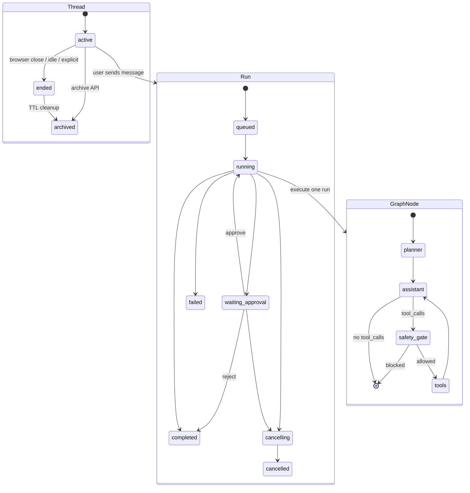

# LearnAgent

LearnAgent 是一个面向学习和演进的本地单用户 Agent Runtime 项目。当前目标不是做完整 SaaS，而是把一个产品级 Agent 所需的核心底座先跑通：多轮会话、后台 run、事件时间线、工具调用审计、RAG、Memory、审批/取消、可回放 Timeline UI。

当前主线技术栈：

```text
FastAPI + LangGraph + LangChain ChatOpenAI + SQLite EventStore + SQLite Checkpoint + RAG + SSE/WebSocket UI
```

当前默认形态：

- 单用户本地运行
- SQLite 作为事实源和 checkpoint 存储
- OpenAI-compatible LLM 接口，已适配 DeepSeek thinking mode
- `/v1/chat` SSE 兼容接口保留
- `/ui/` 提供聊天优先的 Runtime UI
- 不包含多用户权限、生产部署、外部任务队列和完整沙箱隔离

---

## 1. 当前能力

### Chat MVP

- 打开 `/ui/` 后，用户第一次点击发送时自动创建 thread。
- 中间区域是聊天面板，支持多轮消息。
- 发送按钮和取消按钮已合并：
  - 空闲时显示发送图标。
  - 当前 thread 有运行中的 run 时切换为停止图标，点击后 cancel 当前 run。
- 右侧 Runtime Timeline 展示当前 run 的状态、assistant output、事件、工具审计、approval。
- `Approve / Reject` 只在 run 进入 `waiting_approval` 时启用。

### Runtime Core

- `Thread` 表示一条会话容器。
- `Run` 表示一次 Agent 执行。
- `Event` 表示 run 中发生的可回放事实。
- `ExecutionEngine` 使用本地 `asyncio.Task` 管理后台 run。
- 支持：
  - 创建后台 run
  - 查询 run 状态
  - 查询完整事件 timeline
  - cancel
  - approval approve/reject
  - SSE 兼容输出
  - WebSocket run event stream

### Event Store

默认事件库：

```text
storage/learnagent-events.sqlite
```

通过环境变量覆盖：

```env
AGENT_EVENT_STORE_PATH=storage/learnagent-events.sqlite
```

核心表：

- `threads`
- `runs`
- `events`

事件 payload 使用 JSON 存储，对外 API 返回时解析为 `payload` 对象。新事件默认带 `schema_version: 1` envelope。

当前一致性能力：

- `events.sequence` 为每个 run 提供单调递增顺序，timeline 读取按 `sequence,id` 排序。
- `tool_end.call_id` 已做幂等保护，重复写入返回已有事件。
- `run_failed_meta`、`run_consistency_checked`、`checkpoint_sync_failed` 已落地，便于失败 run 回溯。

### LangGraph Agent Loop

当前 graph 结构：

```text
planner -> assistant -> safety_gate -> tools -> assistant
```

说明：

- `planner` 是 route-first planner，基于场景路由写入 `plan_created`，并在工具结果后写入轻量 `plan_updated`；当前不是 LLM Planner / 完整 Plan-and-Execute。
- `assistant` 负责调用 LLM，并可生成文本或 tool calls。
- `safety_gate` 负责危险工具审批和拦截。
- `tools` 由 LangGraph `ToolNode` 执行。
- LangGraph checkpoint 按 `thread_id` 持久化。

### LLM Provider

当前 LLM 入口在：

```text
copilot_agent/llm/provider.py
```

能力：

- 使用 `langchain-openai.ChatOpenAI`。
- 通过 OpenAI-compatible 配置接入 DeepSeek/OpenAI 兼容服务。
- 支持本地代理自动检测：
  - `OPENAI_PROXY_URL`
  - `HTTPS_PROXY` / `HTTP_PROXY`
  - 自动探测 `127.0.0.1:7890,127.0.0.1:7897,127.0.0.1:1080`
- 支持 DeepSeek thinking mode：
  - `OPENAI_THINKING_TYPE=enabled`
  - `OPENAI_REASONING_EFFORT=high`
  - 自动保留并回传 `reasoning_content`
- 支持额外 provider 参数：
  - `OPENAI_EXTRA_BODY_JSON`

### RAG

RAG 入口：

```text
copilot_agent/rag/
```

当前能力：

- 本地文档加载和 manifest 管理。
- Markdown 文档切分。
- 关键词检索、BM25、RRF fusion。
- 可选向量检索和 rerank。
- query rewrite / query route。
- API path extraction。
- RAG hot reload。
- `/v1/rag/status`
- `/v1/rag/reload`
- `/v1/rag/upload`

### Memory

Memory 入口：

```text
copilot_agent/memory/
```

当前分层：

- Working Memory：LangGraph messages + SQLite checkpoint。
- Semantic Memory：RAG 文档检索。
- Episodic Memory：EventStore timeline + deterministic summary。
- Long-term Memory：结构化 memory item store、规则抽取、LLM 抽取、召回策略。

当前能力：

- run 结束后写入 `memory_run_summary`。
- thread 聚合写入 `memory_thread_summary`。
- 新 run 开始前构建 memory context。
- 支持 episodic recall、budget、conflict filter。
- 支持 checkpoint compaction。
- 支持 long-term memory recall。
- `/v1/threads/{thread_id}/memory?goal=...` 可预览注入内容。

### Tool Platform

工具入口：

```text
copilot_agent/tools/
```

当前工具：

- `search_docs`
- `http_get`
- `http_post`

当前抽象：

- `ToolRegistry`
- `ToolSpec`
- category
- risk_level
- requires_approval
- timeout_seconds
- audit_enabled

工具审计：

- `tool_start`
- `tool_end`
- call_id
- category
- risk_level
- requires_approval
- arguments/result 脱敏
- duration_ms
- success/error

敏感字段如 cookie、secret、raw set-cookie 不写入事件 payload。

### Guardrail / Policy

Policy 入口：

```text
copilot_agent/policy/registry.py
```

当前能力：

- HTTP path whitelist。
- 危险 `http_post /api/v1/jobs/watermark` 审批。
- `COPILOT_ALLOW_JOB_POST=false` 时强制禁止危险写操作。
- approval 通过 LangGraph `interrupt()` 暂停。
- approve 后通过 `Command(resume=True)` 继续。
- reject 后通过 `Command(resume=False)` 写入拒绝说明并完成 run。

### Observability

当前能力：

- EventStore timeline 是 runtime 事实源。
- `TimelineProjector` 将 raw events 投影为 UI/API 可读 timeline。
- Langfuse trace/span 可选。
- `trace_id` 已写入 `RuntimeEvent.correlation`，token usage 可进入 `run_completed_meta`。
- Python logging。
- tool_start/tool_end 工具审计。
- run checkpoint meta 和 completed meta。

---

## 2. 目录结构

```text
copilot_agent/
  server.py                    FastAPI 入口
  settings.py                  环境变量配置
  agent/                       LangGraph Agent、runner、节点、事件映射
  contracts/                   Event/tool/result contract 与校验
  llm/                         LLMProvider 与 DeepSeek 兼容适配
  memory/                      MemoryManager、policy、long-term memory、checkpoint compaction
  rag/                         文档检索、索引、rerank、hot reload
  runtime/                     EventStore、ExecutionEngine、Timeline、Run FSM
  tools/                       ToolRegistry、HTTP tools、audit、sanitize
  policy/                      PolicyRegistry
  observability/               Langfuse 与日志
static/
  index.html                   本地 Chat + Timeline UI
docs/                          架构设计和技术选型文档
scripts/                       verification / smoke / regression 脚本
storage/                       默认 SQLite 数据库目录
```

---

## 3. 数据模型

### Thread

Thread 是会话容器，控制这条会话还能不能创建新 run。

状态：

- `active`
- `ended`
- `archived`

语义：

- `active`：允许创建新 run。
- `ended`：会话结束，不允许创建新 run，仍可查询历史。
- `archived`：只读、默认隐藏、保留 timeline，不恢复为 active。

生命周期：

- `active -> ended`：浏览器关闭、显式结束、idle cleanup。
- `ended -> archived`：自动 TTL cleanup。
- `active -> archived`：手动 archive API。

当前配置：

```env
THREAD_ACTIVE_IDLE_TTL_SECONDS=180
THREAD_ENDED_ARCHIVE_TTL_SECONDS=3600
THREAD_LIFECYCLE_CLEANER_INTERVAL_SECONDS=60
```

### Run

Run 是一次 Agent 执行。

状态：

- `queued`
- `running`
- `waiting_approval`
- `cancelling`
- `cancelled`
- `completed`
- `failed`

状态转换集中定义在：

```text
copilot_agent/runtime/run_state.py
```

### Event

常见事件：

- `run_created`
- `run_started`
- `plan_created`
- `token`
- `assistant_state`
- `tool_start`
- `tool_end`
- `approval_required`
- `approval_resolved`
- `run_checkpoint_meta`
- `run_completed_meta`
- `thread_checkpoint_purged`
- `cancel_requested`
- `cancelled`
- `done`
- `error`
- `memory_run_summary`
- `memory_thread_summary`
- `checkpoint_compacted`
- `retrieval_completed`

事件查询支持 cursor 分页：

```http
GET /v1/runs/{run_id}/events?after_id=100&limit=50
GET /v1/threads/{thread_id}/events?run_id={run_id}&after_id=100&limit=50
```

---

## 4. API

### Health

```http
GET /health
```

### Chat SSE

```http
POST /v1/chat
```

请求：

```json
{
  "thread_id": "optional-thread-id",
  "conversation_id": "optional-old-id",
  "messages": [
    {"role": "user", "content": "hello agent"}
  ],
  "confirm_dangerous": false
}
```

SSE 事件：

- `meta`
- `token`
- `assistant_state`
- `tool_start`
- `tool_end`
- `approval_required`
- `done`
- `error`

`assistant_state` 用于隐藏保存 provider 状态，例如 DeepSeek `reasoning_content`，默认不展示给用户。

### Thread

```http
POST /v1/threads
GET  /v1/threads/{thread_id}
POST /v1/threads/{thread_id}/end
POST /v1/threads/{thread_id}/archive
GET  /v1/threads/{thread_id}/runs
GET  /v1/threads/{thread_id}/events
GET  /v1/threads/{thread_id}/memory?goal=...
```

### Run

```http
POST /v1/threads/{thread_id}/runs
GET  /v1/runs/{run_id}
GET  /v1/runs/{run_id}/events
GET  /v1/runs/{run_id}/timeline
GET  /v1/runs/{run_id}/ws
POST /v1/runs/{run_id}/cancel
POST /v1/runs/{run_id}/approve
POST /v1/runs/{run_id}/reject
```

### RAG

```http
GET  /v1/rag/status
POST /v1/rag/reload
POST /v1/rag/upload
```

---

## 5. 本地开发

建议使用 Python 3.12。

### Conda

```powershell
cd E:\code\LearnAgent
conda create -n learnagent312 python=3.12 -y
conda activate learnagent312
python -m pip install -U pip
python -m pip install -r requirements.txt
```

### venv

```powershell
cd E:\code\LearnAgent
python -m venv .venv
.\.venv\Scripts\Activate.ps1
python -m pip install -U pip
python -m pip install -r requirements.txt
```

### .env 示例

```env
OPENAI_API_KEY=sk-...
OPENAI_BASE_URL=https://api.deepseek.com
OPENAI_MODEL=deepseek-v4-pro
OPENAI_PROVIDER=deepseek
OPENAI_REASONING_EFFORT=high
OPENAI_THINKING_TYPE=enabled
OPENAI_EXTRA_BODY_JSON=
OPENAI_DISABLE_THINKING_FOR_TOOLS=false
OPENAI_PROXY_URL=
OPENAI_AUTO_PROXY=true
OPENAI_PROXY_PROBE_HOSTS=127.0.0.1:7890,127.0.0.1:7897,127.0.0.1:1080

SCENARIO=watermark
WATERMARK_API_BASE_URL=http://127.0.0.1:8080

AGENT_CHECKPOINT_PATH=storage/langgraph-checkpoints.sqlite
AGENT_EVENT_STORE_PATH=storage/learnagent-events.sqlite

RAG_USE_VECTOR=false
RAG_REBUILD_INDEX=false
RAG_EMBEDDING_MODEL=BAAI/bge-small-en-v1.5
RAG_HOT_RELOAD_ENABLED=true
HF_HOME=F:\model

LANGFUSE_ENABLED=false
COPILOT_ALLOW_JOB_POST=false

THREAD_ACTIVE_IDLE_TTL_SECONDS=180
THREAD_ENDED_ARCHIVE_TTL_SECONDS=3600

RUN_TIMEOUT_SECONDS=120
MAX_CONCURRENT_RUNS=4
MAX_LLM_INFLIGHT=4

MEMORY_ENABLED=true
MEMORY_THREAD_SUMMARY_MAX_RUNS=5
MEMORY_THREAD_SUMMARY_MAX_CHARS=1200
MEMORY_EPISODIC_RECALL_TOP_K=2
MEMORY_LONG_TERM_ENABLED=true
MEMORY_CHECKPOINT_COMPACT_ENABLED=true
```

### 启动服务

```powershell
cd E:\code\LearnAgent
conda run -n learnagent312 python -m uvicorn copilot_agent.server:app --host 0.0.0.0 --port 8090
```

访问：

- Health: <http://127.0.0.1:8090/health>
- UI: <http://127.0.0.1:8090/ui/>

---

## 6. 验证命令

本地请使用 **`conda run -n learnagent312`**（或已激活的 learnagent312 环境）。  
**PR 门禁与 profile 清单**见 [docs/ci-design.md](docs/ci-design.md)；Eval 分层见 [docs/eval-design.md](docs/eval-design.md)。

```powershell
# 编译检查
conda run -n learnagent312 python -m compileall copilot_agent scripts

# PR 等价（core + rag）
conda run -n learnagent312 python scripts/verify_eval_suite.py --profile core
conda run -n learnagent312 python scripts/verify_eval_suite.py --profile rag

# 本地快检（不进 PR CI）
conda run -n learnagent312 python scripts/verify_eval_suite.py --profile core-fast

# Demo / 夜跑
conda run -n learnagent312 python scripts/verify_eval_suite.py --profile e2e
conda run -n learnagent312 python scripts/verify_eval_suite.py --profile full --enable-ragas
```

可选专项（单套件调试）：

```powershell
conda run -n learnagent312 python scripts/verify_policy_credentials.py
conda run -n learnagent312 python scripts/verify_context_manager.py
conda run -n learnagent312 python scripts/verify_deepseek_provider.py
conda run -n learnagent312 python scripts/smoke_chat_api.py --message "hello agent"

# Optional live provider acceptance, not default CI.
# Requires OPENAI_API_KEY plus optional OPENAI_BASE_URL / OPENAI_MODEL.
conda run -n learnagent312 python scripts/verify_live_llm_e2e_acceptance.py --require-live --message "hello agent"

# RAG compliance lifecycle: ingest/delete audit + deletion proof export.
conda run -n learnagent312 python scripts/verify_rag_document_lifecycle_v1.py
conda run -n learnagent312 python scripts/export_rag_deletion_proof.py --doc-id <doc_id>
```

---

## 7. 设计文档

- [Agent learning guide](docs/agent-learning-guide.md)
- [Runtime design](docs/runtime-design.md)
- [Data flow design](docs/data-flow-design.md)
- [Memory checkpoint design](docs/memory-checkpoint-design.md)
- [Context manager design](docs/context-manager-design.md)
- [RAG design](docs/rag-design.md)
- [Tool design](docs/tool-design.md)
- [Guardrail policy design](docs/guardrail-policy-design.md)
- [Observability design](docs/observability-design.md)
- [Eval design](docs/eval-design.md)
- [CI design](docs/ci-design.md)
- [Tech selection design](docs/tech-selection-design.md)

---

## 8. 当前限制

- 当前是单用户本地 runtime，不是多租户 SaaS。
- 没有完整认证、RBAC、审计后台和生产部署方案。
- 没有外部 durable workflow 系统，后台任务仍是进程内 `asyncio.Task`。
- cancel 是 cooperative cancellation，不是任意 LangGraph node 中途编辑。
- approval 只覆盖当前危险工具策略，不是完整企业审批系统。
- 工具执行没有完整容器/终端沙箱。
- long-term memory 已有基础实现，但仍需要更多业务评测和可视化治理。
- UI 是单文件静态 MVP，不是完整前端应用。

---

## Runtime State Diagram


