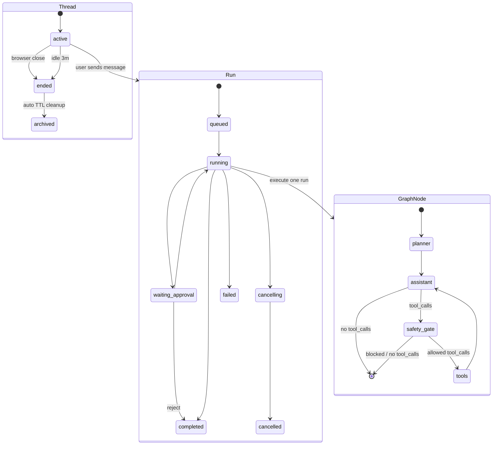

# LearnAgent

LearnAgent 是一个用于学习和演进产品级 Agent Runtime 的 FastAPI + LangGraph 示例项目。当前项目采用的主线框架是：

```text
ChatOpenAI + LangGraph + SQLite/EventStore + RAG + StructuredTool + ExecutionEngine
```

它已经具备 thread、run、event timeline、checkpoint、RAG、工具调用、安全闸门、后台 run 管理、approval 和基础 timeline UI。它还不是完整 SaaS 产品：多用户权限、生产级沙箱、外部任务队列、部署编排、完整 Memory Manager 仍属于后续演进。

## 1. Project Overview

LearnAgent 的目标是把产品级 Agent 系统拆成清晰模块，并逐步实现每个模块的工程边界：

- LLM：推理核心，负责理解输入、调用工具、生成输出。
- Planning：规划与行动编排，当前使用 LangGraph 实现 ReAct-like 流程。
- Memory：工作记忆、语义记忆、事件记忆的组合。
- Tool：工具定义、参数校验、白名单和调用适配。
- Execution Engine：run 生命周期、后台任务、cancel、approval 和事件流。
- Guardrail：安全策略、危险动作拦截、工具边界和用户确认。
- Observability：trace、span、事件时间线和工具审计。
- Memory Manager：后续抽象，用于统一管理摘要、召回和长期记忆。

## 2. Current Capabilities

- **Thread / Run / Event Store**：使用 SQLite 持久化线程、运行记录和可回放事件时间线。
- **SSE 兼容接口**：保留 `POST /v1/chat`，继续输出 `meta`、`token`、`tool_start`、`tool_end`、`done`、`error` 等事件。
- **后台 Run 管理**：支持创建后台 run、查询状态、查询事件、取消 run。
- **Approval 工作流**：危险工具调用进入 `waiting_approval`，可通过 API approve 或 reject。
- **LangGraph + Checkpoint**：对话状态使用 LangGraph 编排，并通过 SQLite checkpoint 持久化。
- **RAG**：从本地文档构建知识检索，支持关键词检索和可选向量检索。
- **工具调用审计**：工具开始和结束事件会记录工具名、call id、参数、结果、耗时和成功状态。
- **Safety Gate**：危险 `POST /api/v1/jobs/watermark` 需要部署开关和用户确认。
- **Timeline UI**：`/ui/` 提供本地 runtime 控制台，用于创建 run、查看事件、cancel、approve 和 reject。

## 3. Agent Architecture Mapping

### LLM

**模块职责**：LLM 是推理核心，负责理解用户输入、结合上下文做决策、选择工具、生成最终回复。

**当前实现**：`copilot_agent/agent/runner.py` 使用 `langchain-openai.ChatOpenAI`，通过 OpenAI-compatible 配置接入 DeepSeek 或 OpenAI 兼容服务。

**当前采用工具**：`ChatOpenAI`、`OPENAI_API_KEY`、`OPENAI_BASE_URL`、`OPENAI_MODEL`。

**下一步细化方向**：`LLMProvider` 已作为薄适配层存在；后续需要设计模型路由、fallback、token/cost 统计、prompt 版本管理。未来可接 `LiteLLM` 作为多模型网关。

### Planning

**模块职责**：Planning 负责把目标拆成可执行步骤，并在执行过程中根据工具结果动态调整。

**当前实现**：`copilot_agent/agent/graph.py` 使用 LangGraph 编排 `assistant -> safety_gate -> tools -> assistant`，属于 ReAct-like 循环。

**当前采用工具**：`LangGraph StateGraph`、`ToolNode`、LangGraph checkpoint。

**下一步细化方向**：当前已有 observe-only `planner` 节点和 `plan_created` 事件；后续需要设计 `plan_updated`、plan step schema 和 Plan-and-Execute 流程。

### Memory

**模块职责**：Memory 解决 LLM 无状态问题，为当前任务、历史轨迹和领域知识提供上下文。

**当前实现**：

- Working Memory：LangGraph messages + SQLite checkpoint。
- Semantic Memory：`copilot_agent/rag/` 文档检索。
- Episodic Memory：`EventStore` 中的 run/event timeline 初版。

**当前采用工具**：SQLite checkpoint、SQLite EventStore、关键词 RAG、可选 Chroma vector RAG。

**下一步细化方向**：`MemoryManager` v1.1 已增加 `memory/policy.py` orchestration：keyword episodic recall、上下文预算、冲突降级、failed/cancelled run 排除；后续可接向量 episodic 与 working memory compression。

### Tool

**模块职责**：Tool 是 Agent 与外部世界交互的接口，负责工具注册、参数 schema、调用适配和结果规范化。

**当前实现**：`copilot_agent/tools/registry.py` 使用 `ToolRegistry` 和 `ToolSpec` 注册 `search_docs`、`http_get`、`http_post`，并向 LangGraph 输出 `StructuredTool`。

**当前采用工具**：LangChain `StructuredTool`、Pydantic schema、`httpx`、`copilot_agent/tools/whitelist.py`。

**下一步细化方向**：继续深化 `ToolRegistry`，补充统一结果协议、工具版本、工具级 timeout/retry enforcement；未来可接 MCP。

### Execution Engine

**模块职责**：Execution Engine 把 LLM 的决策转成真实执行，负责 run 生命周期、任务调度、取消、错误处理和事件输出。

**当前实现**：`copilot_agent/runtime/execution_engine.py` 使用本地 `asyncio.Task` 管理 active run、cancel、approval、stream queue；`RunManager` 保留为兼容别名。

**当前采用工具**：FastAPI、asyncio、SQLite EventStore、SSE、WebSocket event stream。

**下一步细化方向**：增加 retry、幂等键、失败降级；`run_timeout_seconds` 与全局并发限流（`MAX_CONCURRENT_RUNS` / `MAX_LLM_INFLIGHT`）已落地；重启后 `waiting_approval` 可 rehydrate；未来可替换为 Temporal、Celery 或其他外部任务系统。

### Guardrail

**模块职责**：Guardrail 负责输入、工具、输出和权限边界，防止越权调用、危险动作和敏感信息泄露。

**当前实现**：`safety_gate` 拦截危险 `http_post`，HTTP path whitelist 防止任意 URL 访问，cookie 和 set-cookie 会脱敏。

**当前采用工具**：Pydantic、HTTP whitelist、自研 safety gate、`COPILOT_ALLOW_JOB_POST`、run approval。

**下一步细化方向**：`PolicyRegistry` 已承接当前危险工具审批判断；后续需要设计输入校验、输出校验、工具参数策略、secret/PII 检测、approval policy 和权限分级。

### Observability

**模块职责**：Observability 负责记录 Agent 每一步发生了什么，支撑调试、审计、评估和线上排障。

**当前实现**：Langfuse trace/span 记录 LLM 和 tool 链路，EventStore 记录 runtime timeline，`tool_start/tool_end` 记录工具审计。

**当前采用工具**：Langfuse、Python logging、SQLite EventStore。

**下一步细化方向**：统一 `thread_id/run_id` correlation，增加 token/cost/latency metrics，后续接 OpenTelemetry、Prometheus、Sentry。

### Memory Manager

**模块职责**：Memory Manager 是 Memory 的治理层，负责何时写入、何时召回、何时摘要、何时遗忘。

**当前实现**：`copilot_agent/memory/manager.py` + `copilot_agent/memory/policy.py` 提供 v1.1 memory facade：统一 RAG、EventStore、checkpoint path；Run 结束写入 `memory_run_summary` / `memory_thread_summary`；新 Run 读取时经 policy 做 recall、budget、conflict 过滤后注入 `[EpisodicMemory]` SystemMessage。

**当前采用工具**：SQLite checkpoint、EventStore、RAG、`GET /v1/threads/{id}/memory` preview API。

**下一步细化方向**：向量 episodic recall、working memory compression、LLM 长期记忆提取。未来可评估 LangMem、Zep、Mem0。

## 4. Runtime Architecture

```text
Client / Browser
    |
    | REST / SSE / WebSocket event stream
    v
FastAPI server
    |
    +--> ExecutionEngine
    |       |
    |       +--> asyncio.Task per active run
    |       +--> cancel / approve / reject
    |       +--> stream queue for /v1/chat compatibility
    |
    +--> EventStore (SQLite)
    |       |
    |       +--> threads
    |       +--> runs
    |       +--> events
    |
    +--> ChatRunner
            |
            +--> LangGraph assistant -> safety_gate -> tools -> assistant
            +--> RAG search_docs
            +--> http_get / http_post whitelist tools
            +--> LangGraph SQLite checkpoint
```

核心思路是：`ExecutionEngine` 管理运行生命周期，`ChatRunner` 负责 Agent 执行，`EventStore` 负责把 runtime 过程中发生的事情落成可查询、可回放的 timeline。

### 单次 user 消息的三层控制

用户发 **一条消息** 会触发 **一次 Run**；Run 内部再进入 LangGraph 循环。控制交互的责任分三层叠加，而不是由 LangGraph 单独完成：

```text
┌─ 产品层（LearnAgent）─────────────────────────────┐
│  Run FSM: queued → running → waiting_approval …   │  ← EventStore
│  cancel / SSE / 是否允许 create_run               │  ← ExecutionEngine
└───────────────────────┬───────────────────────────┘
                        │ 一次 run_stream
┌─ 编排层（LangGraph）──▼───────────────────────────┐
│  StateGraph: planner → assistant ⇄ tools → END    │  ← 结构 + 条件边
│  State: messages (add_messages 合并)              │
│  Checkpoint: thread_id 持久化                     │
└───────────────────────┬───────────────────────────┘
                        │ 每个 node 内
┌─ 决策层（LLM）────────▼───────────────────────────┐
│  assistant: 生成文本 or tool_calls                │  ← 非确定性
│  tools: 执行后把 ToolMessage 写回 state           │
└───────────────────────────────────────────────────┘
```

| 层级 | 控制什么 | 主要模块 |
|------|----------|----------|
| 产品层 | Run 生命周期、cancel/approve、事件流与审计 | `ExecutionEngine`、`EventStore` |
| 编排层 | 允许走哪些节点、何时结束、checkpoint 续上下文 | `copilot_agent/agent/graph.py` |
| 决策层 | 说什么、调哪个 tool | `ChatOpenAI` + `ToolNode` |

说明：LangGraph 的 `StateGraph` 本质是 **图状态机**（节点 + 条件边）；危险工具 approval 在 **编排层** 使用 LangGraph `interrupt()` + `Command(resume=…)`，**产品层** `ExecutionEngine` 负责 `waiting_approval` FSM、approve/reject API 与 EventStore 审计（见 §6 Approval/cancel）。

关键代码模块：

- `copilot_agent/server.py`：FastAPI 入口，提供 chat、thread、run、event、cancel、approval、WebSocket API。
- `copilot_agent/runtime/event_store.py`：SQLite event store，管理 `threads`、`runs`、`events`。
- `copilot_agent/runtime/execution_engine.py`：本地执行引擎，负责 active run、取消、approval 暂停/恢复和 SSE 兼容流。
- `copilot_agent/runtime/run_manager.py`：兼容旧导入名的薄包装，后续新代码应优先使用 `ExecutionEngine`。
- `copilot_agent/runtime/timeline.py`：CQRS / Projection Read Model，将 raw events 投影为 UI/API 使用的 run timeline。
- `copilot_agent/agent/runner.py`：Agent 执行器，连接 LLM、LangGraph、RAG、工具、安全闸门和事件输出。
- `copilot_agent/agent/graph.py`：LangGraph 状态图，编排 `assistant -> safety_gate -> tools -> assistant`。
- `copilot_agent/rag/`：文档加载、切分、关键词检索、向量索引和混合检索。
- `copilot_agent/memory/manager.py`：Memory facade（working / semantic / episodic）。
- `copilot_agent/memory/policy.py`：Episodic 注入策略（recall、budget、conflict、eligibility）。
- `copilot_agent/tools/`：受控 HTTP 工具，只允许访问白名单 API。

## 5. Data Model

默认事件数据库：

```text
storage/learnagent-events.sqlite
```

可通过环境变量覆盖：

```env
AGENT_EVENT_STORE_PATH=storage/learnagent-events.sqlite
```

### Thread

thread 表示一条长期会话。`/v1/chat` 中的旧 `conversation_id` 现在等价于 `thread_id`，以兼容旧客户端。

最小字段：

- `id`
- `title`
- `status`（`active` / `ended` / `archived`）
- `created_at`
- `updated_at`
- `last_interaction_at`（活跃 thread 的最后交互时间，供 idle 清理）
- `ended_at` / `archived_at` / `end_reason`（生命周期终态）

### Run

run 表示一次 Agent 执行。一个 thread 可以有多个 run。

当前状态：

- `queued`
- `running`
- `waiting_approval`
- `cancelling`
- `cancelled`
- `completed`
- `failed`

### Event

event 是 run 的可回放时间线。常见事件：

- `run_created`
- `run_started`
- `token`
- `tool_start`
- `tool_end`
- `approval_required`
- `approval_resolved`
- `cancel_requested`
- `cancelled`
- `done`
- `error`
- `memory_run_summary`（Run 级 deterministic 摘要，`eligible_for_thread` / `outcome`）
- `memory_thread_summary`（Thread 级聚合摘要，`source_run_ids`）
- `run_checkpoint_meta`（interrupt 时写入 checkpoint 摘要）
- `run_completed_meta`（Run 正常结束时写入 checkpoint 摘要）
- `thread_checkpoint_purged`（thread archive 时清理 checkpoint 的审计事件）

新写入事件的 `payload` 均含 `schema_version: 1`（旧事件无 version 视为 v0）。`EventStore.append_event` 是唯一 envelope 入口。

Episodic 注入与 RAG 隔离：summary 只从 EventStore 读取，不写入 RAG 索引；注入块以 `[EpisodicMemory]` 前缀进入 SystemMessage。

对外 API 会把数据库里的 `payload_json` 解析成 `payload` 对象返回。

事件列表支持 cursor 分页（`event.id` 单调递增）：

```http
GET /v1/runs/{run_id}/events?after_id=100&limit=50
GET /v1/threads/{thread_id}/events?run_id={run_id}&after_id=100&limit=50
```

分页响应：

```json
{"events": [...], "next_after_id": 150, "has_more": true}
```

无 `after_id` / `limit` 查询参数时仍返回全量（向后兼容）；建议客户端对长 Run 使用 cursor 循环。

## 6. Public API

### Chat SSE

```http
POST /v1/chat
```

请求：

```json
{
  "conversation_id": "optional-old-id",
  "thread_id": "optional-thread-id",
  "messages": [
    {"role": "user", "content": "Java API 是否存活？"}
  ],
  "confirm_dangerous": false
}
```

响应为 SSE。`meta` 事件会返回：

```json
{
  "conversation_id": "...",
  "thread_id": "...",
  "run_id": "..."
}
```

### Thread / Run

```http
POST /v1/threads
GET  /v1/threads/{thread_id}
GET  /v1/threads/{thread_id}/runs
GET  /v1/threads/{thread_id}/events
GET  /v1/threads/{thread_id}/events?run_id={run_id}&after_id={id}&limit={n}
GET  /v1/threads/{thread_id}/memory?goal=optional
```

Memory preview（只读，不触发 LLM）：

```http
GET /v1/threads/{thread_id}/memory?goal=check redis
```

返回 `thread_summary`、`recalled_runs`、`inject_preview`、`budget`、`sources`。

```http
POST /v1/threads/{thread_id}/runs
```

```json
{
  "messages": [
    {"role": "user", "content": "检查部署状态"}
  ],
  "confirm_dangerous": false
}
```

查询 run 和事件：

```http
GET /v1/runs/{run_id}
GET /v1/runs/{run_id}/events
GET /v1/runs/{run_id}/events?after_id={id}&limit={n}
GET /v1/runs/{run_id}/timeline
GET /v1/runs/{run_id}/ws
```

`/v1/runs/{run_id}/timeline` 的 `checkpoint` 块从 `run_checkpoint_meta` / `run_completed_meta` 聚合，不暴露 raw checkpoint。

### Cancel / Approval

```http
POST /v1/runs/{run_id}/cancel
POST /v1/runs/{run_id}/approve
POST /v1/runs/{run_id}/reject
```

cancel 是 cooperative cancellation：runtime 会标记取消、取消后台 task，并写入 `cancel_requested` 和 `cancelled` 事件。已经完成、失败或取消的 run 再 cancel，不会重复写终态事件。

approval 用于 `PolicyRegistry.requires_approval` 为 true 的危险工具（如 `http_post` 到 job 路径）。图在 `safety_gate` 内 `interrupt()` 暂停；approve 后 `Command(resume=True)` 从 checkpoint 续跑；reject 使用 `Command(resume=False)` 写入拒绝语义并完成 run。进程重启后，处于 `waiting_approval` 的 run 会被 rehydrate（可 approve/reject，但 SSE 需重连或 polling replay）；`running` / `queued` 等非 approval 等待态仍标记为 failed。

## 7. Module Roadmap

**项目地图（模块划分、职责边界、文档索引）**见 [docs/agent-learning-guide.md](docs/agent-learning-guide.md)。

模块级技术选型对比见 [docs/tech-selection-design.md](docs/tech-selection-design.md)。该文档区分“可直接采用”“可集成但需要适配”和“需要 LearnAgent 设计”的能力，避免把开源框架已有能力误判为项目缺口。

**设计文档**：Runtime 见 [docs/runtime-design.md](docs/runtime-design.md)；数据流契约见 [docs/data-flow-design.md](docs/data-flow-design.md)；Memory 见 [docs/memory-checkpoint-design.md](docs/memory-checkpoint-design.md)；RAG 见 [docs/rag-design.md](docs/rag-design.md)；Guardrail 见 [docs/guardrail-policy-design.md](docs/guardrail-policy-design.md)；Observability 见 [docs/observability-design.md](docs/observability-design.md)。

**CI 与回归**：见 [docs/ci-design.md](docs/ci-design.md)（`agent-ci` + `eval-ci`）；Eval 见 [docs/eval-design.md](docs/eval-design.md)。

| 模块 | 当前工具 | 下一步抽象 | 产品级方向 |
|---|---|---|---|
| LLM | `ChatOpenAI` | `LLMProvider` | LiteLLM、多模型路由、fallback、成本统计 |
| Planning | LangGraph ReAct-like | `planner` 节点 | Plan-and-Execute、plan event、动态修正 |
| Memory | checkpoint + RAG + EventStore summary + policy | `MemoryManager` v1.1 | 向量 episodic、working memory compression |
| Tool | `StructuredTool` | `ToolRegistry` | MCP、权限等级、工具版本、统一结果协议 |
| Execution | `ExecutionEngine + asyncio` | runtime policy | retry、幂等、外部任务队列（timeout 与全局限流已有） |
| Guardrail | safety gate + whitelist | `PolicyRegistry` | PII/secret 检测、输入输出校验、approval policy |
| Observability | Langfuse + EventStore | Trace correlation | OpenTelemetry、Prometheus、Sentry、cost dashboard |

自动优化完成状态：

| 项目 | 状态 | 验证方式 |
|---|---|---|
| `ToolRegistry` | 已独立工具注册和工具元数据，`ChatRunner` 只传入工具实现函数 | `verify_architecture_adapters.py` |
| `MemoryManager` | v1.1 facade + policy（recall/budget/conflict/eligibility）+ memory preview API | `verify_memory_v1.py`、`verify_memory_policy_v1.py`、`verify_architecture_adapters.py` |
| `LLMProvider` | 已封装 OpenAI-compatible `ChatOpenAI` 初始化和 provider metadata | `verify_architecture_adapters.py` |
| `PolicyRegistry` | 已承接危险工具审批判断，保持 safety gate 行为兼容 | `verify_architecture_adapters.py`、`verify_phase3_safety_gate.py` |
| Planning observe node | 已增加 observe-only `planner` 和 `plan_created` event，不改变 ReAct 执行语义 | `verify_architecture_adapters.py` |
| `ExecutionEngine` | 已从 `RunManager` 抽出本地后台执行引擎，`RunManager` 保留为兼容别名 | `verify_runtime_run_manager.py` |
| `TimelineProjector` | 已采用 CQRS / Projection Read Model：EventStore 作为事实源，`/v1/runs/{run_id}/timeline` 返回面向 UI 的聚合 timeline | `verify_runtime_timeline.py` |
| Tool Audit v1 | 已增加 `ToolResult` audit envelope、工具 payload sanitizer、`tool_start/tool_end` 审计契约验证 | `verify_tool_audit_v1.py` |
| Runtime 契约 v1 | Event `schema_version: 1`、cursor 分页 API、`run_completed_meta`、archive 时 checkpoint purge | `verify_runtime_event_store.py`、`verify_runtime_checkpoint_link.py` |
| `ChatRunner` 拆分 | `GraphEventMapper` 单路径 tool 审计；`runner.py` 瘦身为装配门面 | `verify_session_mvp.py`、`verify_runtime_timeline.py` |

剩余更深层能力不在自动优化清单中，因为它们会改变产品语义或 runtime contract，需要单独设计后再实现。

已完成模块的不足和后续优化方向：模块级总表见 [docs/agent-learning-guide.md](docs/agent-learning-guide.md) §3；改造顺序见同文档 §7；技术主线与分项优化见 [docs/tech-selection-design.md](docs/tech-selection-design.md) §4。当前重点仍是先跑通 MVP：已有模块只补影响可用性、可复盘性和安全审计的最小增强，复杂外部框架接入放到后续 PoC。

### MVP 高优先级问题

当前目标是快速跑通 MVP，然后再迭代增强。下一步最关键模块不是继续扩展外部框架，而是把现有 `ExecutionEngine + EventStore + MemoryManager v1 + Timeline UI` 的闭环打磨稳定。

| 优先级 | 模块 / 问题 | 为什么影响 MVP | 下一步动作 |
|---|---|---|---|
| 高 | Runtime / Timeline 闭环 | MVP 必须能稳定创建 run、查看 timeline、cancel、approve/reject，并复盘事件 | 完成一次端到端手工验收脚本：创建 thread/run、观察 SSE/UI timeline、验证 memory summary 事件 |
| 高 | Memory v1 迭代 | v1.1 已落地 policy：recall/budget/conflict/eligibility + memory preview API | 向量 episodic、working memory compression |
| 高 | Tool audit / result consistency | MVP 的可信度依赖工具调用是否可追踪、是否脱敏、是否能定位失败 | 固化 `tool_start/tool_end` 字段检查，补充失败工具调用的审计验证 |
| 中 | Approval/cancel 语义 | interrupt + `Command(resume)` 已对齐 checkpoint；重启后 approval 可 rehydrate | 保持单路径 interrupt；cancel 与 checkpoint  abandon 语义待 PoC |
| 中 | Observability correlation | MVP 排障需要按 `thread_id/run_id` 查事件，但完整 trace/cost dashboard 可后置 | 保持 EventStore 为事实源，后续再接 OpenTelemetry/metrics |
| 低 | 外部 memory / 外部队列 / 多用户权限 | 会增加复杂度，不是跑通单用户本地 MVP 的必要条件 | 暂缓，只保留调研入口 |

## 8. Local Development

建议使用 Python 3.12。Dockerfile 和 CI 都以 Python 3.12 作为当前项目基线。

Conda 环境：

```powershell
cd E:\code\LearnAgent
conda create -n learnagent312 python=3.12 -y
conda activate learnagent312
python -m pip install -U pip
python -m pip install -r requirements.txt
```

如果本机已经安装了 Python 3.12，也可以使用 venv：

```powershell
cd E:\code\LearnAgent
python -m venv .venv
.\.venv\Scripts\Activate.ps1
python -m pip install -U pip
python -m pip install -r requirements.txt
```

配置 `.env`：

```env
OPENAI_API_KEY=sk-...
OPENAI_MODEL=deepseek-chat
OPENAI_BASE_URL=https://api.deepseek.com/v1

WATERMARK_API_BASE_URL=http://127.0.0.1:8080

AGENT_CHECKPOINT_PATH=storage/langgraph-checkpoints.sqlite
AGENT_EVENT_STORE_PATH=storage/learnagent-events.sqlite

RAG_USE_VECTOR=false
RAG_REBUILD_INDEX=false
RAG_EMBEDDING_MODEL=BAAI/bge-small-en-v1.5
HF_HOME=F:\model

COPILOT_ALLOW_JOB_POST=false
LANGFUSE_ENABLED=false

# Memory orchestration (episodic inject)
MEMORY_ENABLED=true
MEMORY_THREAD_SUMMARY_MAX_RUNS=5
MEMORY_THREAD_SUMMARY_MAX_CHARS=1200
MEMORY_EPISODIC_RECALL_TOP_K=2
MEMORY_INCLUDE_FAILED_RUNS=false
MEMORY_INCLUDE_CANCELLED_RUNS=false
MEMORY_KEY_OUTPUT_MAX_CHARS=800
```

启动服务：

```powershell
cd E:\code\LearnAgent
uvicorn copilot_agent.server:app --host 0.0.0.0 --port 8090
```

访问：

- Health: `http://127.0.0.1:8090/health`
- Runtime UI: `http://127.0.0.1:8090/ui/`

## 9. Verification

MVP runtime acceptance：

```powershell
python scripts\verify_mvp_runtime_acceptance.py --event-store-path storage\verify-mvp-runtime-events.sqlite --checkpoint-path storage\verify-mvp-runtime-checkpoints.sqlite
```

该脚本包含 deterministic runtime 闭环和一次真实 `hello agent` `/v1/chat` + LLM agent loop；因此需要 `.env` 中配置可用的 `OPENAI_API_KEY`、`OPENAI_BASE_URL` 和 `OPENAI_MODEL`。

Runtime event store：

```powershell
python scripts\verify_runtime_event_store.py --event-store-path storage\verify-runtime-events.sqlite
```

Memory v1：

```powershell
python scripts\verify_memory_v1.py --event-store-path storage\verify-memory-v1-events.sqlite --checkpoint-path storage\verify-memory-v1-checkpoints.sqlite
```

Memory policy v1：

```powershell
python scripts\verify_memory_policy_v1.py --event-store-path storage\verify-memory-policy-events.sqlite --checkpoint-path storage\verify-memory-policy-checkpoints.sqlite
```

后台 run、cancel、approval：

```powershell
python scripts\verify_runtime_run_manager.py --event-store-path storage\verify-run-manager-events.sqlite
```

Runtime timeline projection:

```powershell
python scripts\verify_runtime_timeline.py --event-store-path storage\verify-runtime-timeline-events.sqlite
```

Runtime checkpoint link + archive purge:

```powershell
python scripts\verify_runtime_checkpoint_link.py --event-store-path storage\verify-runtime-events.sqlite --checkpoint-path storage\verify-runtime-checkpoints.sqlite
```

Tool audit v1:
```powershell
python scripts\verify_tool_audit_v1.py --event-store-path storage\verify-tool-audit-events.sqlite
```

Python 编译检查：

```powershell
python -m compileall copilot_agent scripts
```

LangGraph checkpoint 和 safety gate 回归：

```powershell
python scripts\verify_phase3_checkpoint.py
python scripts\verify_phase3_safety_gate.py
```

RAG / eval 验证：

```powershell
python scripts\build_index.py
python scripts\verify_phase4_dataset.py
python scripts\verify_phase4_ragas.py --mode proxy --disable-vector
```

## Runtime State Diagram


