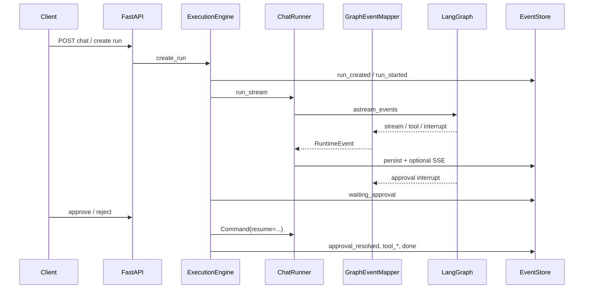

# LearnAgent 数据流与 Contract 设计

> 说明如何用 Pydantic Envelope + Adapter 统一 Agent 各模块边界上的数据形态。  
> 关联文档：[agent-learning-guide.md](./agent-learning-guide.md)、[runtime-design.md](./runtime-design.md)、[tech-selection-design.md](./tech-selection-design.md)、[demo-requirements-design.md](./demo-requirements-design.md)

**K/C/S 位置**：Kernel **M05 Contracts**（跨边界 Envelope + Adapter）；Policy/Credential 相关 payload 形状与 [guardrail §8](./guardrail-policy-design.md) 对齐。详见 [guide §2.4](./agent-learning-guide.md)。

---

## 0. 实现状态

| 项 | 状态 | 验收脚本 |
|---|---|---|
| `RuntimeEvent` / `ToolResultModel` round-trip | ✅ | `verify_contract_events.py` |
| Tool 审计 payload v1 | ✅ | `verify_tool_audit_v1.py` |
| `memory_*` / `retrieval_completed` 子模型 | ✅ | `verify_contract_events.py` |
| `credential_binding_audit` payload | ✅ | `verify_policy_credentials.py` |
| `context_built` payload | ✅ | `verify_context_manager.py`（详见 [context-manager-design.md](./context-manager-design.md)） |
| `ExtractedRecord`（RAG + Memory 共用） | ✅ | `verify_extract_validate.py` |
| `GET /events?validated=1` | ✅ | `verify_events_validated.py` |
| Policy 文档与契约一致性 | ✅ | `verify_policy_docs_contract.py` |
| 最终回答固定 JSON schema | ❌ | — |
| MCP 结果进 `ToolResultModel` | ✅ PoC | `verify_mcp_capability.py` |

套件归属见 [ci-design.md](./ci-design.md)；分层见 [eval-design.md](./eval-design.md)。

---

## 1. 设计动机

LearnAgent 在 **HTTP API → ExecutionEngine → LangGraph → Tool → EventStore → SSE → Timeline** 链路上会同时出现：

| 形态 | 典型例子 | 边界上的风险 |
|---|---|---|
| Pydantic 模型 | `ChatRequest`、`HttpGetArgs` | 只覆盖部分入口 |
| LangChain 消息 | `BaseMessage`、`ToolMessage` | 与产品级事件语义不一致 |
| 扁平 JSON | EventStore `payload_json` | 字段命名漂移（如 `ok` / `success`） |
| 纯文本 | token、RAG excerpt、审批说明 | 难以与结构化审计字段一起回放 |

本设计**不替换** LangGraph / LangChain 内部的 `AgentState.messages`，只在**模块边界**约定统一契约：

- **EventStore** 是写模型事实源（原始 event 行）
- **Timeline / SSE** 是同一套 payload 的读模型或流式视图
- 脱敏、`schema_version`、关联 ID 在 Adapter 层集中处理，业务节点不再散落字段改名

---

## 2. 核心概念

### 2.1 Envelope（`RuntimeEvent`）

跨边界消息共用外壳，把**可机器断言**与**可展示文本**分开：

```text
RuntimeEvent
├── schema_version: int          # 与 contracts/envelope.py 对齐，当前为 1
├── kind: str                    # 与 runtime/event_schema.KNOWN_EVENT_TYPES 一致
├── correlation: CorrelationIds
│     ├── thread_id
│     ├── run_id
│     ├── trace_id               # 可选，Observability
│     └── tool_call_id           # 工具调用关联
├── meta: dict                   # 结构化扩展（resumed、reason 等）
├── content: str | None          # 非结构化主文本（token、用户可见说明）
└── data: dict                   # 结构化载荷（工具参数、检索来源、审批 tool_calls）
```

写入 EventStore 前通过 `to_store_payload()` 展平为单层 JSON，兼容既有 `/ui` 与 REST 客户端；读出时用 `from_stored()` / `from_payload()` 还原。

### 2.2 Tool 结果（`ToolResultModel`）

工具出参统一为：

```text
ToolResultModel
├── success: bool
├── data: dict | ...             # 给 LLM（ToolMessage content）
├── error: str | None
├── duration_ms: int | None
├── sanitized_args: dict | None  # 审计：调用参数脱敏副本
├── sanitized_result: dict | None
└── metadata: dict               # 如 status_code、sources
```

HTTP 层内部仍可能返回 `{ok, status_code, body}`；`HttpResponseAdapter` 在边界将 `ok` 映射为 `success`，LLM 与 Timeline 对外只认 `success`。

### 2.3 Policy 裁决（`PolicyDecision`）

Graph `safety_gate` 使用 Kernel 契约（`contracts/policy.py`），与 Tool 结果分离：

```text
PolicyDecision
├── allowed: bool
├── requires_approval: bool
├── message: str
├── reason: str                    # scenario_tool_denied、credential_scope_denied、job_post_disabled…
└── credential_audits: list[dict]  # 由 safety_gate 写入 EventStore，见 §2.5
```

Capability **只声明** `ToolSpec.required_scopes`；**不**自行写 scope 审计事件。

### 2.4 Adapter（适配器）

每个 Adapter 只做**单一方向**转换，避免在 Node / Handler 里重复 `sanitize` 或改字段名：

| Adapter | 职责 |
|---|---|
| `HttpResponseAdapter` | HTTP response dict → `ToolResultModel` |
| `RagSearchAdapter` | `search_docs` 结果 / `DocChunk[]` → `ToolResultModel` 或 `retrieval_completed` payload |
| `GraphEventMapper` | LangGraph `astream_events` v2 → `RuntimeEvent` 流 |
| `EventStoreAdapter` | `RuntimeEvent` → SQLite `events.payload_json` |
| `SseAdapter` | `RuntimeEvent` → SSE 文本帧 |
| `TimelineProjector` | 原始 event 行 → UI 友好的 `timeline.items` |

### 2.5 Credential binding 审计（`credential_binding_audit`）

M12/M14 与 EventStore 的交界事件；**never 含 secret**：

```text
credential_binding_audit
├── action: scope_allowed | scope_denied | credential_set | credential_read_denied
├── binding_id: str
├── provider: str
├── credential_type: str
├── granted_scopes: list[str]
├── required_scopes: list[str]
├── tool_name?: str
├── reason?: str                   # credential_scope_denied、login_set_cookie…
└── user_id?: str
```

- **写入点**：`safety_gate`（PolicyGate scope 裁决）、`tool_handlers`（login 存 cookie / handler 层 scope 拒绝）。
- **校验**：`CredentialBindingAuditPayload`（`contracts/events/payloads.py`）+ `verify_policy_credentials.py`。
- 与 Guardrail 分工见 [guardrail-policy-design.md](./guardrail-policy-design.md) §8。

### 2.6 Context 装配审计（`context_built`）

Context Manager 单轮装配摘要（budget、truncation、preretrieval 等），契约见 `ContextBuiltPayload`；设计见 [context-manager-design.md](./context-manager-design.md)。

### 2.7 检索依据事件（`retrieval_completed`）

Tool-grounded RAG 除 `tool_start` / `tool_end` 外，单独记录检索依据，便于 Timeline 展示「查了哪些文档」而不挤进 tool 参数里：

```text
retrieval_completed.data
├── query: str
├── call_id?: str                 ← 与 search_docs tool_start 对齐
├── sources[]: {
│     source_file, section_title?, heading_path?, doc_type?,
│     start_line, chunk_index,
│     http_method?, http_path?,   ← 结构化 ingest
│     request_field_names[], error_codes[]
│   }
├── source_count, excerpt_chars, success
├── retrieval_mode?, retrieval_route?
```

`search_docs` ToolResult  additionally：`suggested_api_paths[]`，`api_field_hints[]`（见 [rag-design.md](./rag-design.md) §6.1）。

`TimelineProjector` 将其投影为 `kind: "retrieval"`，含 `query`、`sources`、`preview`、`call_id`。

---

## 3. 端到端数据流

### 3.1 总览

```text
Client
  │  ChatRequest / CreateRunRequest (Pydantic)
  ▼
FastAPI (server.py)
  ▼
ExecutionEngine                    ← Run 状态机、审批、取消、并发
  │  ManagedRun { messages, confirm_dangerous, ... }
  ▼
ChatRunner.run_stream()
  │  MemoryContext → SystemMessage（episodic 注入）
  │  graph_input: { messages: BaseMessage[] }     ← LangGraph 边界
  ▼
LangGraph: planner → assistant → safety_gate → tools
  │                              └─ interrupt → waiting_approval
  ▼
GraphEventMapper → RuntimeEvent 流
  ├─ EventStoreAdapter / MemoryManager.append_event
  └─ SseAdapter → SSE（/v1/chat）
  ▼
Run 结束：finalize_memory → memory_* 事件
  ▼
GET /v1/runs/{id}/timeline → TimelineProjector
```

### 3.2 时序（含审批）



---

## 4. 代码组织（`copilot_agent/contracts/`）

```
contracts/
├── envelope.py          # schema_version、envelope_payload
├── base.py              # RuntimeEvent、CorrelationIds
├── tool_result.py       # ToolResultModel
├── validate.py          # 持久化事件的契约校验
├── events/
│   ├── payloads.py      # ToolStart/End、Retrieval、ContextBuilt、CredentialBindingAudit…
│   ├── registry.py      # kind -> Pydantic 校验
│   └── retrieval.py     # build_retrieval_completed_payload
└── adapters/
    ├── event_store.py
    ├── sse.py
    ├── tool_http.py
    └── tool_rag.py
```

业务策略（白名单、审批、Memory 策略）仍留在 `policy/`、`tools/`、`memory/`，contracts 包只放**形状**与**边界转换**。

---

## 5. 边界交互格式

### 5.1 HTTP API

| 端点 | 请求体 | 响应 / 流 |
|---|---|---|
| `POST /v1/chat` | `ChatRequest` | SSE（`token`、`tool_*`、`approval_*`、`done`） |
| `POST /v1/threads/{id}/runs` | `CreateRunRequest` | `{ run }` |
| `POST /v1/runs/{id}/approve` | — | `{ run }` |
| `GET /v1/runs/{id}/timeline` | — | `{ run, timeline, events }` |

### 5.2 LangGraph `RunnableConfig.configurable`

```python
{
    "thread_id": str,
    "conversation_id": str,   # 通常与 thread_id 相同
    "run_id": str,
    "input_messages": list[dict],
    "confirm_dangerous": bool,
    "allow_job_post": bool,
    "trace": Any,             # Langfuse，不写入 EventStore
}
```

### 5.3 工具入参（Pydantic）

- `SearchDocsArgs`：`query`
- `HttpGetArgs`：`path`, `cookie_header?`
- `HttpPostArgs`：`path`, `json_body`, `cookie_header?`, `idempotency_key?`

工具 handler 返回 `ToolResultModel.to_llm_dict()` 给 LangGraph；审计与 Timeline 使用 `tool_start` / `tool_end` 事件中附带的脱敏字段。

### 5.4 EventStore 行

表结构不变：`threads` / `runs` / `events`。每行 `events.payload_json` 为展平后的 JSON，且带 `schema_version: 1`。常见 `kind` 包括：

`run_created`、`run_started`、`token`、`assistant_state`、`tool_start`、`tool_end`、`retrieval_completed`、`context_built`、**`credential_binding_audit`**、`approval_required`、`approval_resolved`、`done`、`error`、`memory_run_summary`、`checkpoint_compacted`、`run_completed_meta` 等（完整列表见 `runtime/event_schema.py`）。

### 5.5 SSE

```text
event: {kind}
data: {与 EventStore 相同的 payload JSON}

```

由 `SseAdapter.encode(RuntimeEvent)` 生成。

---

## 6. 结构化 vs 非结构化分工

| 场景 | 结构化（`data` / `meta`） | 非结构化（`content` / UI preview） |
|---|---|---|
| LLM 流式输出 | — | `content` = token 文本 |
| `search_docs` | `sources[]`、`excerpt_chars` | RAG excerpt（在 tool `data` 或 `retrieval_completed`） |
| HTTP 工具 | `status_code`、body 摘要 | — |
| 审批 | `tool_calls`、reason | 用户可见 block 文案 |
| Timeline 聚合 | `success`、`duration_ms` | `assistant_output`、`retrieval.preview` |

原则：**机器断言与 Eval 看 `data`/`meta`**；**人类复盘看 Timeline 与 `content`**。

---

## 7. 模块职责一览

| 层级 | 模块 | 职责 |
|---|---|---|
| 入口 | `server.py` | REST / SSE / WebSocket，Pydantic 请求体 |
| 执行 | `runtime/execution_engine.py` | Run 生命周期、审批恢复、超时、流队列 |
| 编排 | `agent/graph.py`、`agent/nodes.py` | LangGraph 图与安全闸门；`safety_gate` 写 scope audit |
| 策略 | `policy/registry.py` | `PolicyDecision` + `credential_audits` 生成 |
| 凭据 | `credentials/` | binding 元数据；audit payload 构建（`credentials/audit.py`） |
| 映射 | `agent/stream/event_mapper.py` | 图事件 → `RuntimeEvent` |
| 推理入口 | `agent/runner.py` | 组装上下文、驱动图、`_emit(RuntimeEvent)` |
| 工具 | `agent/tool_handlers.py` | RAG / HTTP 调用 + `retrieval_completed` 落库 |
| 契约 | `contracts/*` | Envelope、ToolResult、Adapter、validate |
| 审计 | `tools/sanitize.py`、`tools/audit.py` | 脱敏与 `tool_*` payload 构建 |
| 事实源 | `runtime/event_store.py` | 持久化 thread / run / event |
| 读模型 | `runtime/timeline.py` | 投影为 UI 时间线 |
| 记忆 | `memory/manager.py` | RAG、episodic 注入、run/thread 摘要 |

事件契约统一使用 `RuntimeEvent`。

---

## 8. 扩展与版本演进

新增事件种类时：

1. 在 `runtime/event_schema.py` 注册常量并加入 `KNOWN_EVENT_TYPES`
2. 在 `GraphEventMapper` 或对应 handler 产出 `RuntimeEvent`
3. 如需 Timeline 展示，在 `TimelineProjector` 增加投影分支
4. 若 payload 形状稳定，可再在 `contracts/events/` 增加 Pydantic 子模型（discriminated union）

`schema_version` 升级时建议：先兼容读旧版，再批量迁移 SQLite 或双写；避免在未迁移数据上直接改字段语义。

待产品侧再定的细节（不影响当前主链路阅读）：

- LLM 可见的 tool 内容是全量 JSON 还是摘要文本
- ~~是否在 REST 上暴露 `GET /events?validated=1` 返回校验后的 `RuntimeEvent[]`~~ ✅ Wave1：`?validated=1` 已在 thread/run events API 提供
- 外部队列 / MCP 接入时 Adapter 如何映射到同一 `ToolResultModel`

### 8.1 八层栈改造分配（待办）

Wave1 已完成项见 **§0**。路线图索引：[agent-learning-guide §7](./agent-learning-guide.md)。

| 波次 | 层 | 任务 | 验收 |
|------|-----|------|------|
| **3** | L7 Output | `FinalAnswerModel` v2：answer + citations + tool evidence + citation status + safety metadata | `verify_final_answer_l7.py` |
| **3** | L7 | ToolMessage 摘要策略（全量 JSON vs 截断）文档化 + 配置项 | eval case |

---

## 9. 非目标

- 不把 LangGraph 内部消息全面 Pydantic 化
- 不为契约单独引入第二套并行事件存储
- 不在本文档定义 Run FSM 与 cancel/approve（见 [runtime-design.md](./runtime-design.md)）
- 不在本文档定义具体 Eval 脚本与 CI 门禁（见 [eval-design.md](./eval-design.md)）
