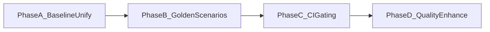

# LearnAgent Eval 实施计划（文件级）

## 1. 背景与目标

LearnAgent 现有 `verify_*` 脚本已经覆盖 Runtime/Session/Memory/Tool/RAG 的多个关键点，但仍以“分散脚本”形态存在，缺少统一入口、统一结果协议和稳定 CI 门禁。  
本计划目标是把现有能力整合为可持续的 Eval 体系：**可回归、可门禁、可诊断、可演进**。

计划范围：

- 统一评测入口与 summary schema
- 建立 8-10 条 golden scenarios
- 形成 PR 必跑 + 夜跑增强的 CI 策略
- 把框架选型与实施决策沉淀为可维护文档

## 2. Eval 框架横向对比（结合 LearnAgent）

| 方案 | 适用范围 | 优势 | 限制 | 与 LearnAgent 适配结论 |
|---|---|---|---|---|
| Promptfoo | 多场景批量评测、模型对比、CI 编排 | 声明式用例与 CI 友好，适合 golden scenarios 编排 | 复杂 runtime 语义需要自定义断言脚本 | 作为“场景编排层”推荐 |
| RAGAS | RAG 检索/回答质量指标 | 指标成熟，便于做 RAG 专项评估 | 对 runtime contract 覆盖不足 | 作为 RAG 专项评估保留 |
| DeepEval | LLM-as-judge、回答质量打分 | 评估维度丰富，适合增强质量洞察 | 成本高、波动大，不适合首轮硬门禁 | 后置增强，先夜跑 |
| LangSmith Evals | LangChain/LangGraph 生态评测与可观测 | 样本管理、追踪和可视化较强 | 依赖外部 SaaS，不符合“本地优先”首要目标 | 可选增强，不作为首轮主门禁 |
| 自研 `verify_*` | runtime contract 与产品语义回归 | 与 EventStore/Timeline/ExecutionEngine 紧耦合，断言精确 | 缺统一入口与输出协议 | 作为主门禁基础，优先整合 |

### 选型结论

- 主线：`verify_* + Promptfoo（场景编排）+ RAGAS（RAG专项）`
- 增强：`DeepEval`（LLM-as-judge）+ 可选 `LangSmith`（样本与可观测）
- 门禁原则：**PR 走 deterministic 主门禁，LLM judge 先夜跑不阻塞主干**

## 3. 现有资产映射

已存在并可直接复用的脚本：

- Runtime acceptance：`scripts/verify_mvp_runtime_acceptance.py`
- Session/审批/并发：`scripts/verify_session_mvp.py`
- Runtime contract：`scripts/verify_runtime_event_store.py`、`scripts/verify_runtime_timeline.py`、`scripts/verify_runtime_checkpoint_link.py`
- RAG 评测：`scripts/verify_phase4_ragas.py`

文档基线：

- `docs/agent-learning-guide.md`
- `docs/agent-runtime-tech-selection.md`
- `docs/ci-status.md`

## 4. 实施路径（任务级）



### Phase A：统一评测入口与输出协议

目标：一条命令统一执行 core/rag/full 套件，并输出聚合 summary。

#### A1. 新增评测总控脚本

- 新增文件：`scripts/verify_eval_suite.py`
- 功能：
  - 通过 `--profile` 选择 `core` / `rag` / `full`
  - 调用已有 `verify_*` 脚本并收集输出
  - 生成聚合文件 `artifacts/eval/eval-suite-summary.json`

#### A2. 统一 summary schema（每个子脚本的标准投影）

统一字段（聚合层）：

```json
{
  "suite_name": "runtime_event_store",
  "script": "scripts/verify_runtime_event_store.py",
  "status": "PASS",
  "duration_ms": 1200,
  "summary_json": "artifacts/runtime/event-store-summary.json",
  "checks": {
    "schema_ok": true,
    "pagination_ok": true
  },
  "artifacts": [
    "artifacts/runtime/event-store-summary.json"
  ],
  "errors": []
}
```

#### A3. 产物定义

- 聚合总览：`artifacts/eval/eval-suite-summary.json`
- 控制台输出：
  - `profile=core|rag|full`
  - `suites_total`
  - `suites_failed`
  - `eval_suite=PASS|FAIL`

### Phase B：Golden Scenarios 数据集化

目标：把端到端行为断言从“脚本内硬编码”升级为“数据驱动场景集”。

#### B1. 新增场景集文件

- 新增文件：`eval/golden/runtime-golden-scenarios.json`
- 先放 8-10 条 case，覆盖：
  1. 正常问答触发 `search_docs`
  2. 危险 `http_post` 触发 `approval_required`
  3. approve 后工具执行且终态 completed
  4. reject 后无工具执行
  5. cancel 生命周期完整（`cancel_requested` + `cancelled`）
  6. timeline 包含 checkpoint 元数据
  7. memory 注入预算约束
  8. thread lifecycle（active -> ended -> archived）

#### B2. 每条场景最小字段

- `id`
- `input`（thread/message/flags）
- `must_have_events`
- `must_not_have_events`
- `expected_run_status`
- `notes`

### Phase C：CI 门禁接入

目标：PR 阶段提供稳定门禁，夜跑提供增强洞察。

#### C1. 新增工作流

- 新增文件：`.github/workflows/eval-ci.yml`

建议分层：

- PR 必跑：`python scripts/verify_eval_suite.py --profile core`
- 夜跑增强：`python scripts/verify_eval_suite.py --profile full --enable-ragas`

#### C2. Job Summary 口径

- `overall_pass`
- `failed_scenarios`
- `runtime_contract_breaks`
- `rag_metrics`
- `artifact_links`

### Phase D：质量增强（后置）

目标：在不影响主门禁稳定性的前提下，增强语义质量评测。

- 引入 `DeepEval`（或等价 judge）
- 输出 `artifacts/eval/judge-summary.json`
- 初期仅报警，不阻塞 PR
- 连续稳定后再评估是否纳入软门禁

## 5. 里程碑与验收标准

### M1（Baseline）

- 完成 `verify_eval_suite.py`
- 可执行 `--profile core`
- 有统一聚合 summary

验收：

- 本地单命令得到 `eval_suite=PASS|FAIL`
- 失败可定位到具体子套件

### M2（Golden）

- 场景集 >= 8 条
- 每条场景可自动断言

验收：

- 失败输出明确 `case id`
- 不依赖人工日志判读

### M3（CI）

- PR core 门禁稳定运行
- 夜跑 full/rag 输出趋势

验收：

- PR 可见失败套件/失败 case
- 可本地复现 CI 失败

### M4（Enhance）

- judge 轨道产出稳定评分

验收：

- judge 报表可用于回归观察
- 不影响主干开发效率

## 6. 风险与缓解

- LLM judge 波动：主门禁保持 deterministic；judge 仅夜跑
- 脚本输出不一致：先统一 summary schema 再接入聚合
- 场景漂移：golden 数据集版本化，变更必须记录基线差异

## 7. 推荐执行顺序（两周样板）

- Week 1：
  - Day 1-2：Phase A（入口 + schema）
  - Day 3-4：Phase B（8-10 场景）
  - Day 5：Phase C（PR core 门禁）
- Week 2：
  - Day 1-2：修复门禁噪声与误报
  - Day 3-5：Phase D PoC（judge 夜跑）

## 8. 本地执行命令（计划态）

```powershell
python scripts/verify_eval_suite.py --profile core
python scripts/verify_eval_suite.py --profile rag --enable-ragas
python scripts/verify_eval_suite.py --profile full --enable-ragas
```

## 9. 与现有文档的关系

- 该文档是 Eval 维度的实施细化，承接：
  - `docs/agent-learning-guide.md`（模块优先级）
  - `docs/agent-runtime-tech-selection.md`（技术选型）
- 后续任何门禁口径调整，应同时更新 `docs/ci-status.md`。
